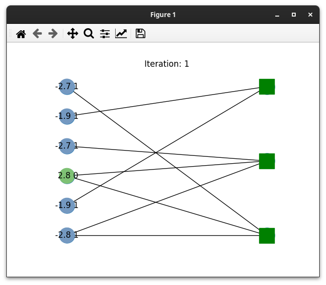

# LDPC visualization
Use this tool to see what happens on the Tanner graph of LDPC decoders.



## Features
- Works with any code
- Flexible number of decoding iterations
- Plot the BER vs Eb/N0
- Works in visual mode or not

## Before Running
On Linux, run:
```
source .pypath
```

## Examples
This code comes with few examples contained under the ```examples``` directory:
- Simple LDPC decoder test for (6,3) code showing an animation of the decoding process (```ldpc_test.py```) 
- Simple LDPC decoder test for (6,3) code (```ldpc_sim.py```) 
- Comparison among different H matrices (6,3) codes (```ldpc_sim_cmp.py```)
- Comparison among different LDPC codes (```ldpc_test_diff.py```)